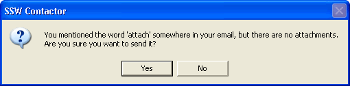

   
When you refer to an attachment in your email, don't forget to include the attachment. I always attach the files first before I write my message.  

 <excerpt class='endintro'></excerpt> 
   

We have a program called <a href="http://www.ssw.com.au/ssw/LookOut/">SSW LookOut! for Outlook</a> to check for this rule.  
 Figure: SSW LookOut! for Outlook automatically warns you if you have forgotten to include your attachments. 

