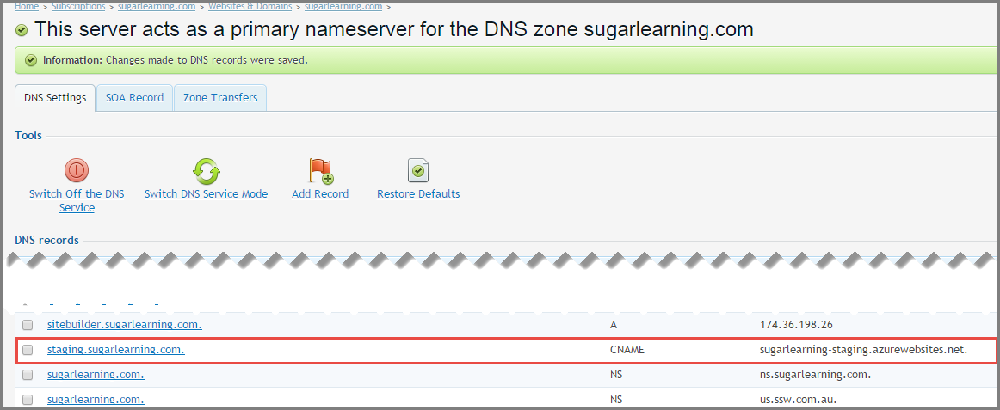
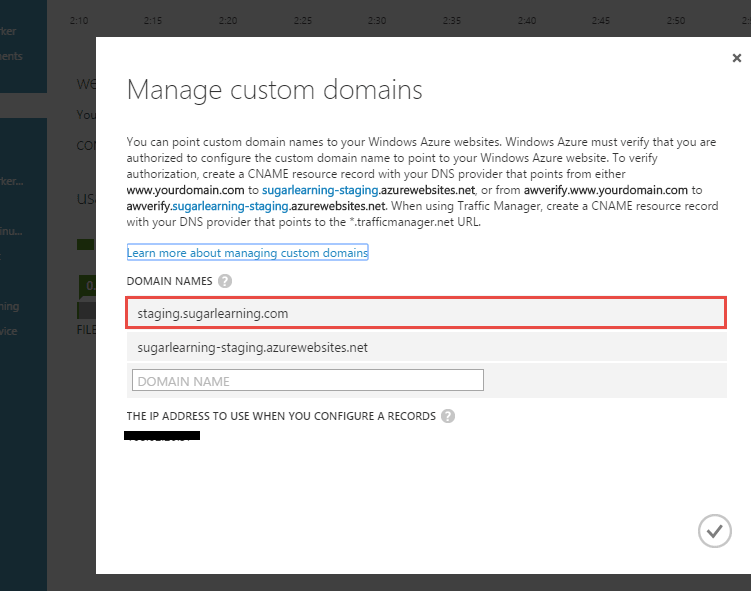

If you use the default Azure staging website URL, it can be difficult to remember and a waste of time trying to lookup the name every time you access it. Follow this rule to increase your productivity and make it easier for everyone to access your staging site.

<!--endintro-->

::: greybox
Default Azure URL:
sugarlearning**-staging**&#46;azurewebsites&#46;net
:::
::: bad
Figure: Bad example - Site using the default URL (hard to remember!!)  
:::

::: greybox
Customized URL:
**staging**&#46;sugarlearning&#46;com
:::
::: good
Figure: Good example - Staging URL with "staging&#46;" prefix  
:::

### How to setup a custom URL

1. Add a CName to the default URL to your DNS server

 

2. Instruct Azure to accept the custom URL

