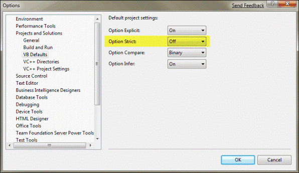
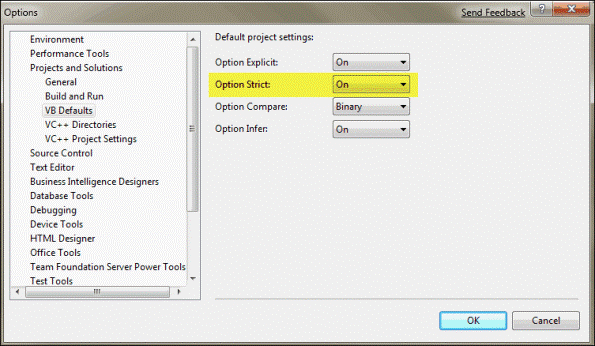

Fixing the Option Strict problem is one of the most annoying aspects of the Visual Basic development environment relates to Microsofts' decision to allow late binding. By turning Option Strict Off by default, many type-casting errors are not caught until runtime. You can make VB work the same as other MS languages (which always do strict type-checking at design time) by modifying these templates.   
<!--endintro-->

So, always set Option Strict On right from the beginning of the development.

Before you do this, you should first back up the entire VBWizards directory. If you make a mistake, then the templates will not load in the VS environment. You need to be able to restore the default templates if your updates cause problems.

To configure each template to default Option Strict to On rather than Off, load each .vbproj template with VB source code into an editor like Notepad and then change the XML that defines the template. For example, to do this for the Windows Application template, load the file: Windows Application\Templates\1033\WindowsApplication.vbproj

Technically, you do not have to add the Option Explicit directive, because this is the default for VB; but I like to do it for consistency. Next, you must save the file and close Notepad. Now, if you load a new Windows Application project in the VS environment and examine Project Properties, you will see that Option Strict has been turned on by default.
 

::: bad
Figure:Bad Example – Option Strict is Off  
:::
 

::: good
Figure:Good Example – Option Strict is On  
:::

In order for this setting to take effect for all project types, you must update each of the corresponding .vbproj templates. After making the changes on your system, you will need to deploy the new templates to each of your developers' machines in order for their new projects to derive from the updated templates.

However, sometimes we don't do this because of too much work. In some scenarios, such as Wrappers around the COM code, and Outlook stuff with object model, there is going to be lots of work to fix all the type-checking errors. Actually it is necessary to use Object type as parameters or variables when you deal with COM components.
