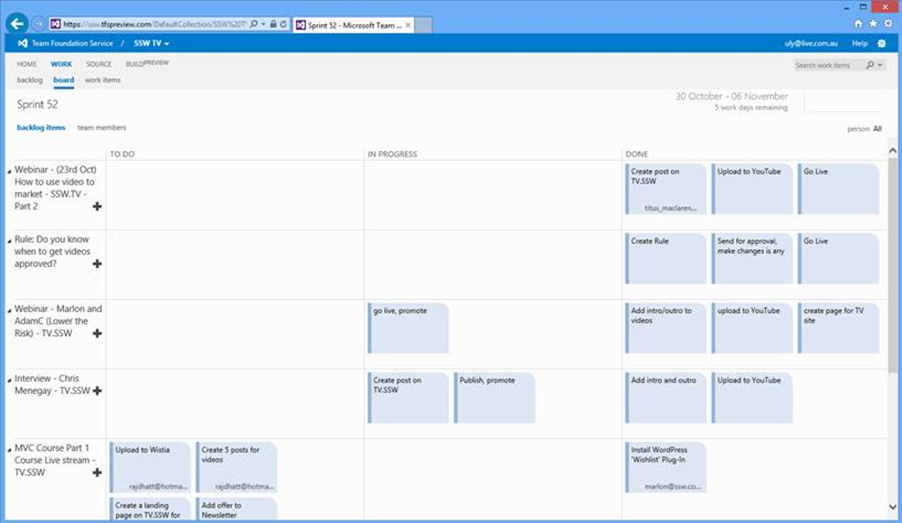

Although the team will always strive to complete all the items on the sprint backlog within the sprint, it’s not uncommon for them to not finish all of them. If this is the case, you want to at least make sure that the PO's (Product Owner)’s most important items are done. 
<!--endintro-->

Whenever you are choosing your next task, always work from the top down, only skipping items if there is a dependency or another good reason why a lower item needs to be done first.

