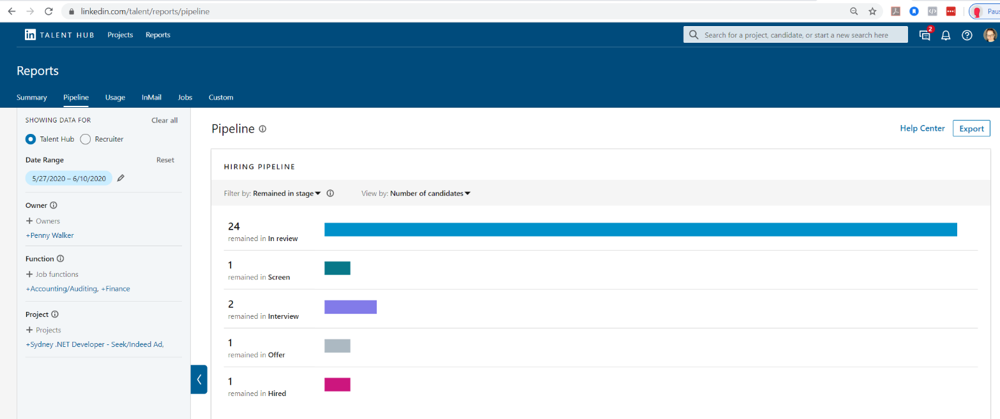
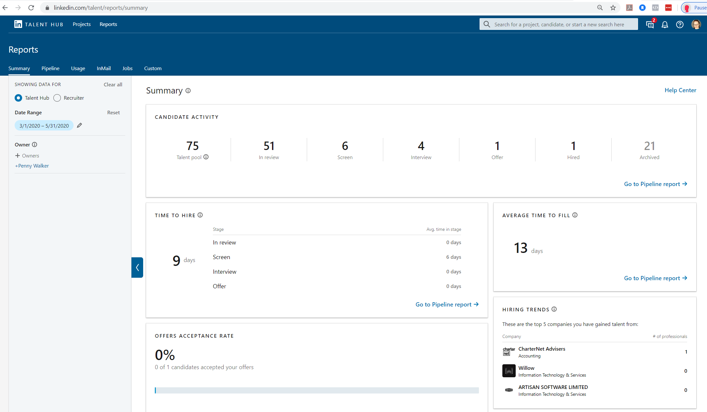

In order to give you candidates the best experience, you need to be constantly analysing​ your process and improving it where you can. 
 <excerpt class='endintro'></excerpt> 

​An Applicant Tracking System (ATS) system like LinkedIn Talent Hub gives you the ability to track your recruitment data, as well as your candidates.  It allows you to analyse things like: 
<ul><li>Your candidate funnel - how many candidates went into the top of the funnel, and how many made it through to each stage of the process.</li><li>How long it took to recruit someone, from posting the job ad, to signing the contract.</li><li>When they applied & when they were hired.</li><li>Where candidates dropped out of your process.</li><li>Where you candidates came from, and where they may have previously worked. </li><li>If your process has any issues – for example, where you lost the most people, or if a stage took too long to complete.​ </li></ul><dl class="ssw15-rteElement-ImageArea"></dl>
<strong>F</strong><strong>igure: A report from LinkedIn Talent Hub showing the how many people remain in each stage of your recruitment process. </strong> 
<dl class="ssw15-rteElement-ImageArea"></dl>
<strong>Figure: LinkedIn Hub that is used alongside LinkedIn Recruiter. You can see how many candidates go into your pipeline, how many make it to each stage of your recruitment process, and how long it takes at each stage, including the “time to hire”. This should show how efficient your process is, and if you lose too many candidates at certain stages in your process. </strong>

<strong> </strong>

