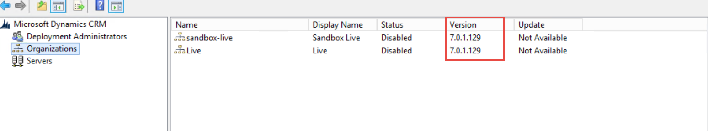

Make sure CRM 2015 update rollup 1 has been applied before upgrading to CRM 2016.

<!--endintro-->



**Note:** You might come accross the error below while applying CRM 2015 update rollup 1.

``` sql
Database update install failed for orgId = 011d5962-3475-4df9-a123-c3ecaf88b048. Continuing with other orgs. Exception: System.Reflection.TargetInvocationException: Exception has been thrown by the target of an invocation. ---> System.Data.SqlClient.SqlException: The current transaction cannot be committed and cannot support operations that write to the log file. Roll back the transaction.</div><div>Uncommittable transaction is detected at the end of the batch. The transaction is rolled back.
```

**Solution:** 
  
* Make a backup of the file MetadataDiffs.xml from “C:\Program Files\Microsoft Dynamics CRM\Setup\Serviceability\Latest\Actions_Org\Install”
 
* Open the file MetadataDiffs.xml from “C:\Program Files\Microsoft Dynamics CRM\Setup\Serviceability\Latest\Actions_Org\Install” 

* Remove the entry about the index “cndx_BusinessDataLocalizedLabel”. This is found at the very end of the file:

  ``` xml
  <index Name="cndx_BusinessDataLocalizedLabel">
     <EntityId&gt;4ba1569e-3c9c-4d9f-99ea-b61fb08d7f97&lt;/EntityId>
     <IsClustered>1</IsClustered>
     <IsUnique>1</IsUnique>
     <IndexType>6</IndexType&gt;
    <IsPrimaryKey>0</IsPrimaryKe>
     <attributes>
       <attribute AttributeId="d88e1df3-b5b3-42f3-9ffa-007f22951dd4" IsSystemManaged="1" order="0" />
       <attribute AttributeId="bb23d3c8-8d18-40d3-9519-66101a8cae34" IsSystemManaged="1" order="1" />
       <attribute AttributeId="976e1053-5faa-4c3f-be6e-669acfec9d5a" IsSystemManaged="1" order="2" />
       <attribute AttributeId="e81341c4-4d4a-4977-98eb-6597fcde2cc4" IsSystemManaged="1" order="3" />
    </attributes>
   </index>
  ```
  
* Close Deployment Manager
* Start Deployment Manager
* Start the organization update from Deployment manager
* Run the following query on the organization DB to manually recreate the index

  ``` sql
  IF EXISTS (SELECT * FROM sys.indexes WHERE name = 'cndx_BusinessDataLocalizedLabel' AND OBJECT_NAME(object_id) = 'BusinessDataLocalizedLabelBase') DROP INDEX [cndx_BusinessDataLocalizedLabel] ON [BusinessDataLocalizedLabelBase];
  IF NOT EXISTS (SELECT * FROM sys.indexes WHERE NAME = 'cndx_BusinessDataLocalizedLabel' AND OBJECT_NAME(object_id) = 'BusinessDataLocalizedLabelBase')
  BEGIN TRY
   CREATE UNIQUE CLUSTERED INDEX [cndx_BusinessDataLocalizedLabel] ON [BusinessDataLocalizedLabelBase]([ObjectId] ASC, [ObjectIdTypeCode] ASC, [ObjectColumnNumber] ASC, [LanguageId] ASC) WITH (FILLFACTOR = 80, MAXDOP = 4, SORT_IN_TEMPDB = ON, ONLINE = ON)
  END TRY
  BEGIN CATCH
   CREATE UNIQUE CLUSTERED INDEX [cndx_BusinessDataLocalizedLabel] ON [BusinessDataLocalizedLabelBase]([ObjectId] ASC, [ObjectIdTypeCode] ASC, [ObjectColumnNumber] ASC, [LanguageId] ASC) WITH (FILLFACTOR = 80, MAXDOP = 4, SORT_IN_TEMPDB = ON)
  END CATCH
  ```

* Restore the file MetadataDiffs.xml to its original state using the backup taken at step 1

**Source:** [Error updating Microsoft Dynamics CRM 2015 0.1](https://community.dynamics.com/forums/thread/details/?threadid=8f9d9ec1-541e-4562-a813-f548550061e4)
