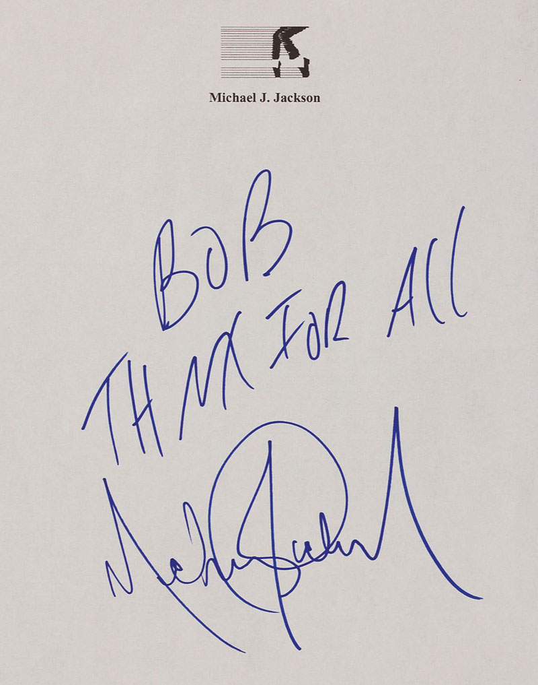

A person's signature is extremely valuable. Getting a signature is hard work. Salespeople use all sorts of euphemisms to avoid that confronting request: "if you could just sign here..."

<!--endintro-->

However, requesting a  **signature** (or just an initial) on non-contractual type documents (especially screenshots, mockups, or data-schemas) is very beneficial.

When you ask a client to 'review this screen mock-up' they will generally take a cursory glance, perhaps make a comment or two and then move on to something else. Asking them to initial/sign the document always makes them take a second or third look, ask someone else, or at least spend a few more minutes working out whether it's correct or not.

Training clients to review the work carefully leads to better quality projects.
<dl class="image">&lt;dt&gt;
       
   &lt;/dt&gt;<dd>Figure: A signature can be very valuable but sometimes hard to obtain, like Michael Jackson's autograph </dd></dl>
### Related Rule

* [Do you conduct specification analysis by creating mock-ups?](/_layouts/15/FIXUPREDIRECT.ASPX?WebId=3dfc0e07-e23a-4cbb-aac2-e778b71166a2&TermSetId=07da3ddf-0924-4cd2-a6d4-a4809ae20160&TermId=63802172-2609-4a24-816b-bbf10a190109)
