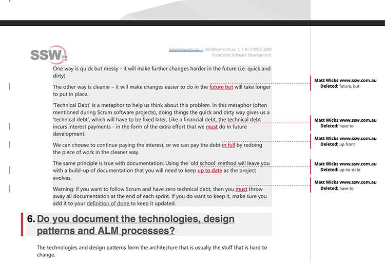

When asking for changes to be made to any file like a web page, Word document, PowerPoint slide or code, always include the original version of the content ("X") together with the changes you require ("Y"). This means you have at hand a history of the page or file as it currently stands allowing for convenient future reference and also makes it very clear to the person doing the changes exactly what the new file is meant to look like. 

Make the changes even easier to see and understand by highlighting in red what you want to delete (only do this on the "From" section) and in <mark>yellow</mark> what you want to be added/updated (only do this on the "To" section).  All text we do not write ourselves should be indented, so this includes paragraphs we are copying and pasting (see [Do you use indentation for readability?](/do-you-use-indentation-for-readability))

<!--endintro-->

#### From X...

::: email-template  
|          |     |
| -------- | --- |
| To:      | Eric |
| Subject: | Update CodeAuditor features list |  
::: email-content  

### Hi Eric,

1. For the Code Auditor web page, please make the list read:

   &nbsp;&nbsp;&nbsp;&nbsp;Scan all your projects for coding errors
   
   &nbsp;&nbsp;&nbsp;&nbsp;Guarantee Industry best practices
   
   &nbsp;&nbsp;&nbsp;&nbsp;Friendly licensing model, bloggers even pay $0 for the full version!

:::  
:::  
::: bad
Figure: Bad example - original version of content has not been included in the email
:::

#### ...to Y

::: email-template  
|          |     |
| -------- | --- |
| To:      | Eric |
| Subject: | Update CodeAuditor features list |  
::: email-content  

### Hi Eric,

http://www.ssw.com.au/ssw/codeauditor
1. On the Code Auditor web page, please change:

From:

  &nbsp;&nbsp;&nbsp;&nbsp;Scan all your projects for coding bugs and errors
  
  &nbsp;&nbsp;&nbsp;&nbsp;Enforce industry best practices
  
  &nbsp;&nbsp;&nbsp;&nbsp;Friendly licensing model pay nothing for the full version!

To:

  &nbsp;&nbsp;&nbsp;&nbsp;Scan all your projects for coding errors
  
  &nbsp;&nbsp;&nbsp;&nbsp;Guarantee industry best practices
  
  &nbsp;&nbsp;&nbsp;&nbsp;Friendly licensing model<mark>, bloggers even pay $0</mark> for the full version!

:::  
:::  
::: good
Figure: Good Example - it has 'From' and 'To' with changes highlighted... so it is clear what needs to be changed
:::

### What if there are too many changes?

Sometimes you have a lot of content and too many changes, making the process "from X to Y" too arduous. In this case is recommended to use [Word 'Track Changes'](https://support.microsoft.com/en-gb/office/track-changes-in-word-197ba630-0f5f-4a8e-9a77-3712475e806a?ui=en-us&rs=en-gb&ad=gb) functionality.

  

**Video:** [Top 10+ Rules to Better Email Communication with Ulysses Maclaren](https://www.youtube.com/watch?v=LAqRokqq4jI)

### What if you have a website managed by GitHub?

Some websites use GitHub to manage their files (e.g. [SSW Rules](https://github.com/SSWConsulting/SSW.Rules.Content)). GitHub makes reviewing changes easy through "pull requests".

A pull request is a request to make changes to 1 or more files. GitHub provides out of the box functionality for reviewing changes in a pull request. This process is as follows

1. Open the pull request
2. Examine the changes using the tabs
    * Conversations: see comments people have made about the change
    * Commits: see comments associated with the changes the requester has made
    * Checks: You can ignore this if you are not a developer
    * Files changed **\* Important \***: see the difference between the old and new files being changed. Red highlighting indicates deleted parts and green highlighting indicates added parts. 

    

    

    
3. Next is to approve or ask for changes.

    1.&nbsp;Files changed | Review changes</pre>

    2.&nbsp;Add a comment with your feedback.

    3.&nbsp;Choose "Approve" to mark it as ready to go live. 

      If it is not ready, then choose "Comment" for general feedback or "Request changes" for mandatory changes.

    4.&nbsp;Press "Submit review" so that the requester can see it.
      

4. Congratulations! Your review has been submitted ⭐
