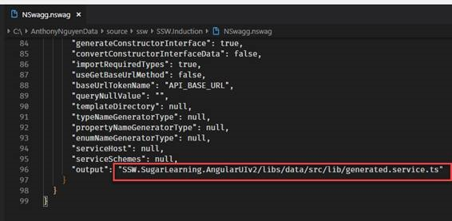

If your changes to your WebAPI break your client, then you want to know right away.

Using NSwag you should generate your API client eg. Angular Client.

* You run nswag.exe on the post-build event
* Nswag will generate the client code and update the API client file directly

<!--endintro-->
<dl class="goodImage">&lt;dt&gt;&lt;/dt&gt;<dd>Figure: Good example – using NSwag config file helps with automation. Since the API client is generated automatically next time we build, any breaking changes will be obvious immediately </dd></dl>
Now this is automated this is no longer a concern we need to deal with.

**More info:** http://www.codingflow.net/building-single-page-applications-on-asp-net-core-2-1-with-angular-6-part-3-implementing-open-api/
