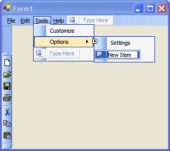

The menu & toolbar controls in Visual Studio .NET 2003 do not allow you to have icons in your menus or have alpha-blended toolbar icons. They also do not provide an Office 2003 like look. However, we have tried several third party menu and toolbar controls and all of them had serious bugs. E.g.:

<!--endintro-->

- DotNetMagic
  - Docking panels didn't implement enough events and it is unclear what the events are doing
  - Menu control is OK
- DotNetBar
- Janus Systems

We love 3rd party controls, a lot of developers spend a lot of time implementing these tools to make their applications sweeter, but we found that there is not enough benefit in implementing these controls.

I am very keen on 3rd party controls, but only where they add real value. Knowing about Visual Studio 2005 which provides Office 2003 style menus and toolbars with the new **ToolStrip** control mean I will wait in this case....Another worry is upgrading from these 3rd party controls will be difficult)

However, it would be better if VS 2005 stored the details of menus and toolbars in an XML file.
