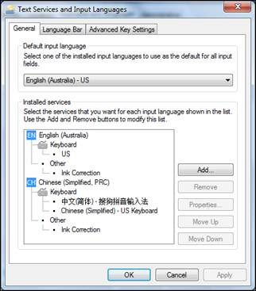

Many companies use overseas developers to do some of their work, but the language barrier can sometimes extend past simply communications. Sometimes you can end up with foreign language snippets in your code too.

When you edit an aspx page in TFS, follow the below steps to avoid having Chinese characters appear.

<!--endintro-->

1. Set the default language on your computer as English(Australia).

2. After you finish editing, but before check-in, make sure Code Auditor and Link Auditor 0.
3. Check the whole page which you edited, and make sure no messy code or characters are there.
4. Ask someone beside you to check the rule or page you just edited.
5. Reply done in an email.
