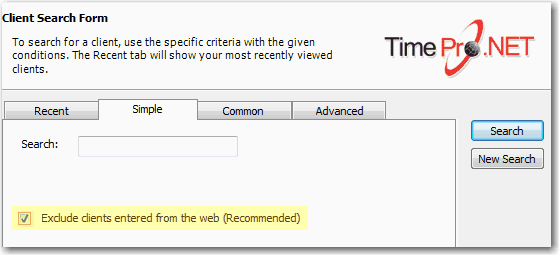

When there are too many choices always Default to the most common ones. Then add a checkbox to allow the advanced users to turn off the common choices.

<!--endintro-->

::: greybox
[x] Only include common choices  
:::

Likewise in a contacts database where you have entries from all around the world it is good to add a check box on the search screen similar to the following:

::: greybox
[x] Only include customers that have been updated by employees (not directly entered from the web)  
:::

A good example on that the checkbox on the search screen of TimePRO.NET:

::: good  
  
:::

Read our rule on [Validation - Do you avoid capturing incorrect data?](/validation-do-you-avoid-capturing-incorrect-data)
