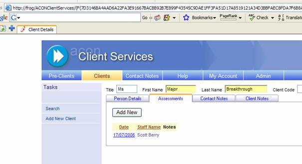
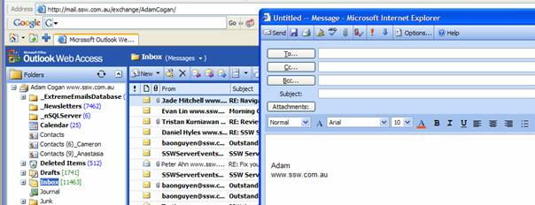
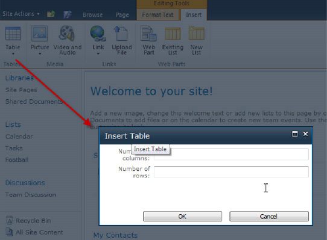

For any case of 'Add New', choose to open a new window (popup) for entering data.

<!--endintro-->
<dl class="image">&lt;dt&gt;
      
   &lt;/dt&gt;<dd>Figure: The 'Add New' button changes from a view into a data entry form</dd></dl><dl class="badImage">&lt;dt&gt;
      
   &lt;/dt&gt;<dd>Figure: Bad Example - The 'Add New' button, shown in Figure 1, opened the page in the same window</dd></dl>
It is better to open in a new form, reasons being:

* It is better for the user in terms of clarity. The change of view to data entry form can be a surprise
* It is better to code e.g. if you are using this control in a couple of places you may need to show or hide 'Save' buttons etc. Otherwise, it is a pain to make it behave differently in different contexts.

However, you do need to call back on save and requery it.
 Use a modal form and requery it (DON'T use JavaScript, instead use the Modal Popup Form Example)
 An example of this is in Outlook with the 'New' button.
<dl class="goodImage">&lt;dt&gt;
      
   &lt;/dt&gt;<dd>Figure: Good Example - the 'New' button in Outlook opens a new form for you to construct your email</dd></dl><dl class="image">&lt;dt&gt;
      
   &lt;/dt&gt;<dd>Figure: Adding a table in SharePoint have a popup with dimmed background</dd></dl>
