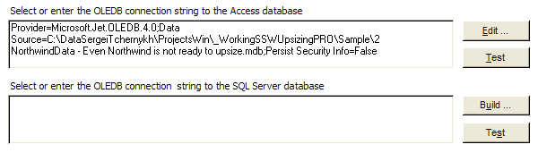
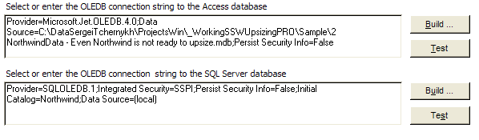

The buttons that a user will typically use should not be dynamically labeled across your applications.

<!--endintro-->
<dl class="badImage">&lt;dt&gt;
      
   &lt;/dt&gt;<dd>Figure: Bad Example - Buttons are dynamically labeled "Build ..." and "Edit ..." depending on text in the text box</dd></dl><dl class="goodImage">&lt;dt&gt;
      
   &lt;/dt&gt;<dd>Figure: Good Example - Buttons are not dynamically labelled</dd></dl>
