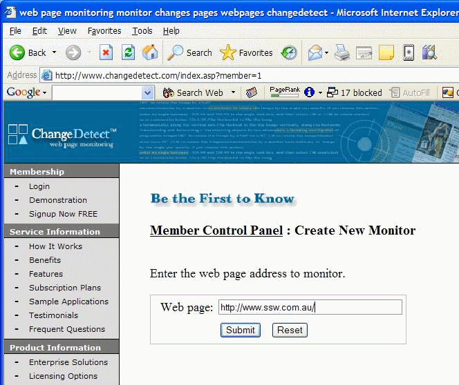

Why do web pages have "Reset" buttons? I have been entering forms on the web for more years than I care to remember, but have never needed to click this button. The worst thing is I have accidentally hit it a few times after - I have a habit of doing 3 things at once - it happens just after I have finished entering everything and click the first button.

<!--endintro-->

More detailed information about this rule can be found in this article: [Reset and Cancel Buttons](https://www.nngroup.com/articles/reset-and-cancel-buttons/).

  

We have a program called [SSW CodeAuditor](https://www.ssw.com.au/ssw/CodeAuditor/) to check for this rule.

We have a program called [SSW LinkAuditor](https://www.ssw.com.au/ssw/LinkAuditor/) to check for this rule.
