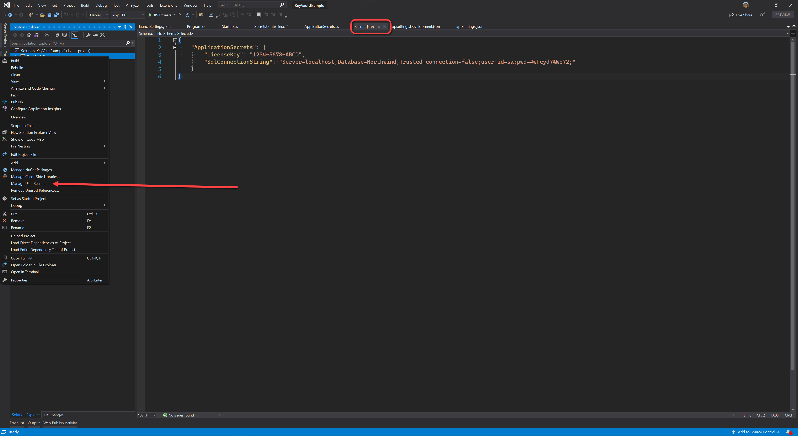

Many websites have screenshots images to illustrate content instructions. With so many different screens sizes and resolutions, you probably have seen a screenshot that was unreadable. 

You don't want that in your website! Always make sure the screenshots you share as content are readable to the user.

<!--endintro-->

### How to ensure your screenshots are readable:

Only keep what is relevant: crop your image when you can.

In the cases where you do need a full screenshot, it's a good idea to allow users to open the image in a bigger size, e.g. use [lightboxes](https://www.w3schools.com/howto/howto_js_lightbox.asp)

::: bad  
  
:::

::: good  
  
:::
