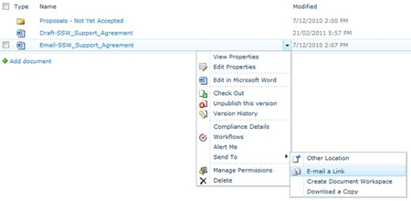

When your attachment is too big, you should think twice.

<!--endintro-->

1. Avoid large attachments. So if you are sending an email that is **&gt;1MB** you need to take one second to think:
    * Could a URL be better than this attachment? (see example on the right)
    * Could I send this as a UNC to an internal share?
    * Could I .zip this?
    * Could I put this picture on Flickr or Picasa?

::: email-template  
|          |     |
| -------- | --- |
| To:      | XXX |
| Cc:      | YYY |
| Bcc:     | ZZZ |
| Subject: | This is the subject |  
::: email-content  

### Dear Mike,

Thank you for spending time with us to come to a better understanding of your business requirements. Please review the new version of the artwork at **FileName.png **

PS: Sending the image as a link as it is too big to attach. 

Regards, 
Adam Cogan 

:::  
:::  

PS: An added advantage is that the document stays alive. If the URL has been updated and a user takes a week to get around to this email, they will view the latest version.

2. If you have to attach multiple files, consider Zip.

3. Use screen captures - pictures do tell a thousand words - but don't include unnecessarily huge images or attachments in your email. Generally the only time you will have serious size problems is if you are using Rich Text instead of HTML inside Outlook.

4. If you are sending screenshots then just send the relevant part of the image you need. 

PS: Avoid **.bmp**. Use **.jpg**, **.gif** or **.png** instead.

5. If you are sending pictures (every year digital cameras are making our photos bigger and bigger) you may need to resize them down. You can either use Photoshop or for something quicker try Office Document Imaging. 

6. SharePoint was built with sharing files in mind and is a great way to collaborate. If you are using SharePoint to send a file you simply need to open the context menu, click "send to" and "email a link" as shown: 

### When can you break these size rules?

Basically, you should be practical:

1. Keep history
2. Paste images into the email - not into a Word document and attach (so it stays with the customers' reply)
3. When you paste a URL, also paste the section of the web page you are referring to (allows for offline reading)

