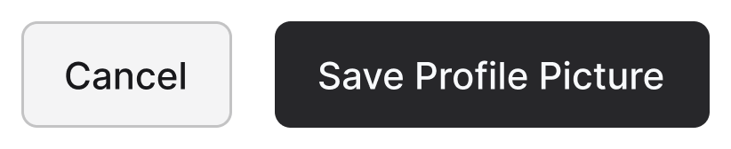

While "OK" buttons were the standard convention with operating systems of the past, web applications should use a more user-friendly approach to dialog boxes. Instead of "OK" buttons to confirm an action the users want, it’s more efficient and effective to give them button that is labeled with that specific action.  
<!--endintro-->
<dl class="badImage">&lt;dt&gt;&lt;/dt&gt;<dd>Figure: Bad example - web application button labeled as "OK"</dd></dl><dl class="goodImage">&lt;dt&gt;&lt;/dt&gt;<dd>Figure: Good example - button is labeled with the specific action</dd></dl>
