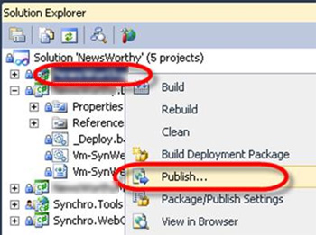
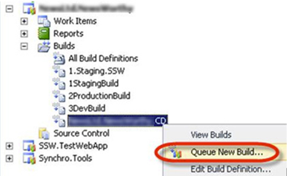
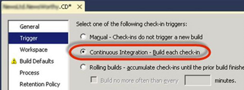

Publishing from Visual Studio is a convenient way to deploy a web application, but it relies on a single developer’s machine which can lead to problems. Deploying to production should be easily repeatable, and able to be performed from different machines.

<!--endintro-->

A better way to deploy is by using a defined Build in TFS.
<dl class="badImage">&lt;dt&gt;
      
   &lt;/dt&gt;<dd>Figure: Bad Example – Using Publish to deploy </dd></dl><dl class="goodImage">&lt;dt&gt;
      
   &lt;/dt&gt;<dd>Figure: Good Example – Queuing a new build to deploy your application</dd></dl><dl class="goodImage">&lt;dt&gt;
      
   &lt;/dt&gt;<dd>Figure: Best example – Use continuous integration to trigger your Continuous Deployment build</dd></dl>
