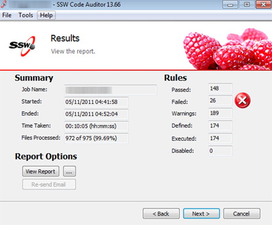
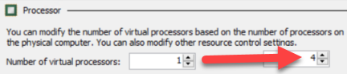
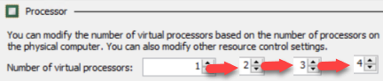

If a client says:

::: greybox
*"This application is too slow, I don't really want to put up with such poor performance. Please fix."*
:::

We don't jump in and look at the code and clean it up and reply with something like:

::: greybox
*"I've looked at the code and cleaned it up - not sure if this is suitable - please tell me if you are OK with the performance now."*
:::

<!--endintro-->

A better way is:

* Ask the client to tell us how slow it is (in seconds) and how fast they ideally would like it (in seconds)
* Add some code to record the time the function takes to run
* Reproduce the steps and record the time
* Change the code
* Reproduce the steps and record the time again
* Reply to the customer:
"It was 22 seconds, you asked for around 10 seconds. It is now 8 seconds."

<dl class="image">&lt;dt&gt;&lt;/dt&gt;<dd>Figure: Good example – Add some code to check the timing, before fixing any performance issues (An example from SSW Code Auditor)</dd></dl>
Also, never forget to do incremental changes in your tests!

For example, if you are trying to measure the optimal number of processors for a server, do not go from 1 processor to 4 processors at once:
<dl class="badImage">&lt;dt&gt;&lt;/dt&gt;<dd>Figure: Bad Example - Going from 1 to 4 all at once gives you incomplete measurements and data</dd></dl>
Do it incrementally, adding 1 processor each time, measuring the results, and then adding more:
<dl class="goodImage">&lt;dt&gt;&lt;/dt&gt;<dd>Figure: Good Example - Going from 1 to 2, then measuring, then incrementally adding one more, measuring...</dd></dl>
This gives you the most complete set of data to work from.

This is because performance is an emotional thing, sometimes it just \*feels\* slower. Without numbers, a person cannot really know for sure whether something has become quicker. By making the changes incrementally, you can be assured that there aren’t bad changes canceling out the effect of good changes.

### Samples

For sample code on how to measure performance for Windows application form, please refer to rule [Do you have tests for Performance?](http://www.ssw.com.au/ssw/Standards/Rules/RulesToBetterUnitTests.aspx#Performance) on [Rules To Better Unit Tests](http://www.ssw.com.au/ssw/Standards/Rules/RulesToBetterUnitTests.aspx).

### Related Rule

* [Do you keep your website loading time acceptable?](/_layouts/15/FIXUPREDIRECT.ASPX?WebId=3dfc0e07-e23a-4cbb-aac2-e778b71166a2&TermSetId=07da3ddf-0924-4cd2-a6d4-a4809ae20160&TermId=cb28d27b-542f-4f02-bfa4-31b3672ed0d5)
* [Do you know the steps required to implement a performance improvement?](/_layouts/15/FIXUPREDIRECT.ASPX?WebId=3dfc0e07-e23a-4cbb-aac2-e778b71166a2&TermSetId=07da3ddf-0924-4cd2-a6d4-a4809ae20160&TermId=30c5fcee-c2e9-4705-9a87-a910edb57ae3)
