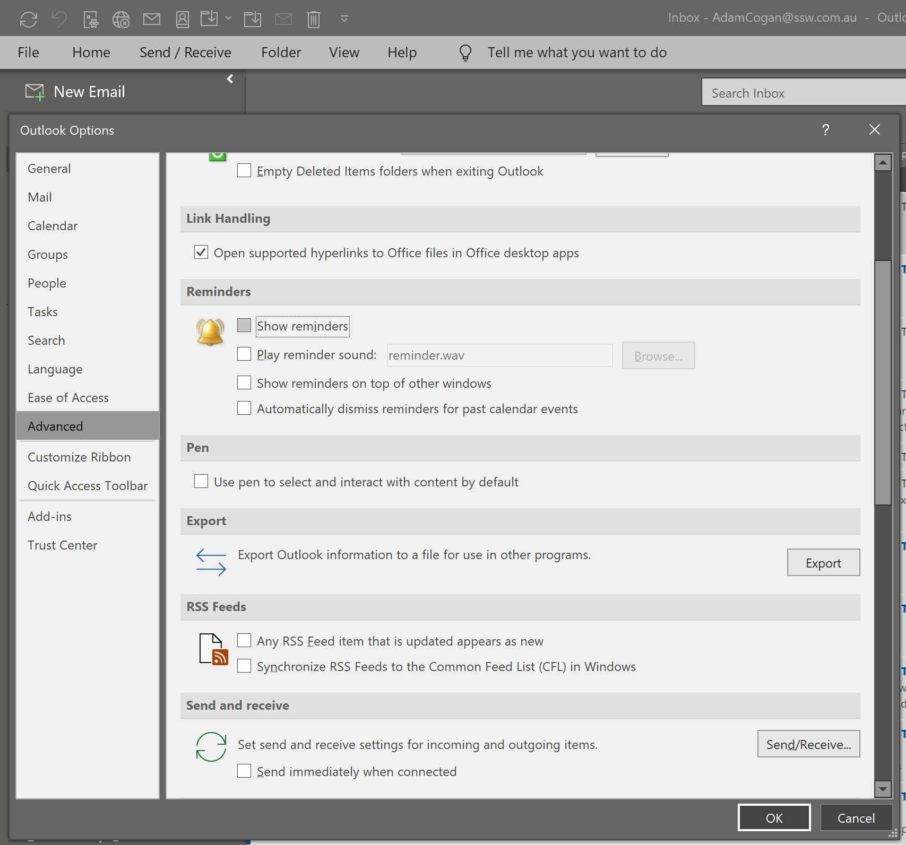

​How often have you clicked "Send" and then wished you hadn't? It's a common problem. It can be easily solved by unchecking the "Send Immediately When Connected" option in Tools/ Options/ Mail Setup. We guarantee this will save you, one day!
 

 <excerpt class='endintro'></excerpt> 
<dl class="image"><dt></dt><dd>​Figure: Don't send emails immediately - you will often remember something you needed to add</dd></dl>

