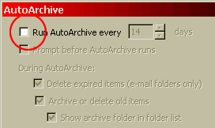
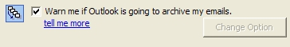

If you use Exchange Server, Auto-Archive moves the archived items from the Exchange Server to a local drive on your notebook or desktop. While this keeps your Exchange Server nice and small, if you happen to use email to store legal documents, or want to search for emails you've sent a year ago, Auto-Archive is like throwing data away.  
<!--endintro-->
**Figure: Turn off AutoArchive so your emails do not get thrown away** 
I promise you'll be thankful you never deleted your Sent Items.

We have a program called [SSW LookOut! for Outlook](http://www.ssw.com.au/ssw/LookOut/) to check for this rule. 

SSW LookOut! for Outlook can tell you if you have archive on.
**Figure: SSW LookOut! for Outlook warns you if Outlook is set to archive your emails**
