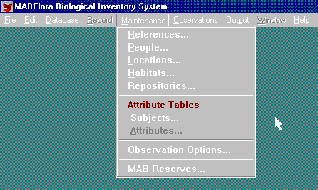

Using a separate menu to maintain ComboBoxes is never a good idea. A  better solution is to use an ellipses button to drill down into the  menu.

<!--endintro-->
<dl class="badImage">&lt;dt&gt;
      
   &lt;/dt&gt;<dd>Figure: Bad Example - Menu driven ComboBox maintenance form</dd></dl><dl class="goodImage">&lt;dt&gt;
      
   &lt;/dt&gt;<dd>Figure: Good Example - Use ellipses to drill down into a ComboBox maintenance form</dd></dl>
