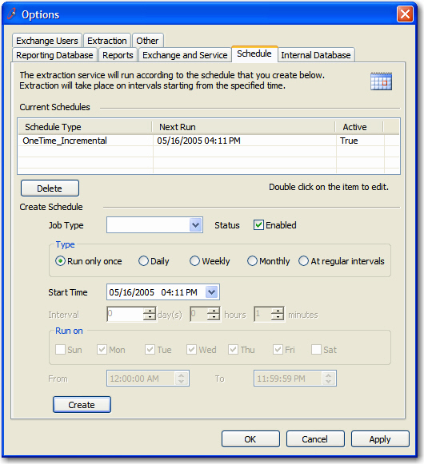
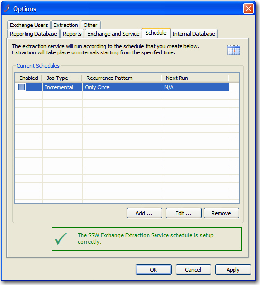

Combining data entry and find navigation is a mistake. I think 2 forms  are better than one. I prefer a list box on one form with "Add", "Edit"  and "Delete" buttons to a popup form. Rather than a listbox and the data  entry fields on one form.

<!--endintro-->
<dl class="badImage">&lt;dt&gt;
      
   &lt;/dt&gt;<dd>Figure: Bad Example - ListView with data entry fields in one form</dd></dl><dl class="goodImage">&lt;dt&gt;
      
   &lt;/dt&gt;<dd>Figure: Good Example - ListView with only 'Add' 'Edit' 'Delete' buttons</dd></dl>
When you want to create a new entry or edit one, just click the buttons and open a new form with all the data entry fields.
<dl class="goodImage">&lt;dt&gt;
      
   &lt;/dt&gt;<dd>Figure: Good Example - Separate form with all the data entry fields</dd></dl>
