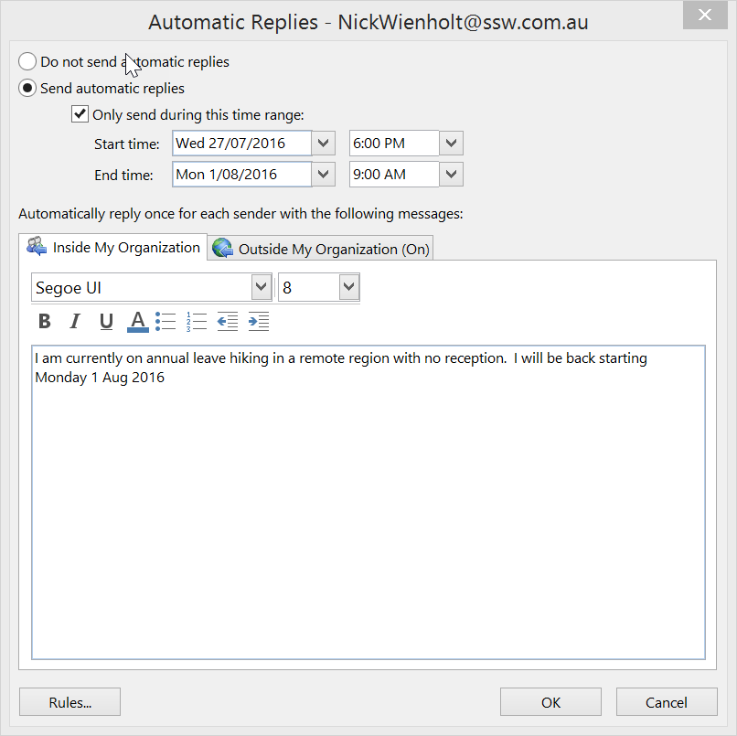
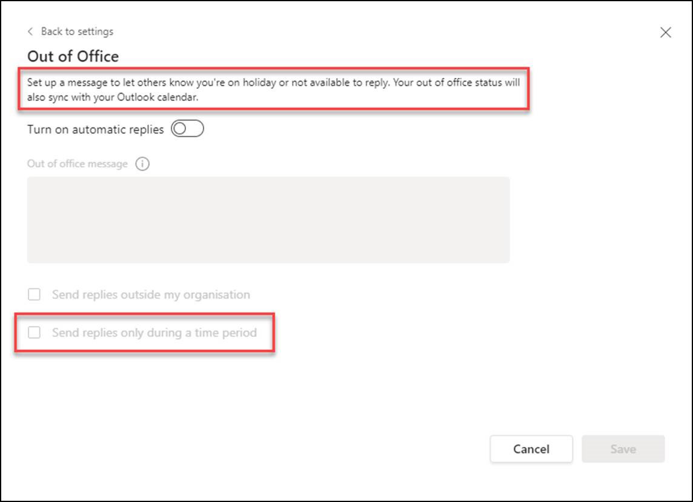

When you are on leave, you need to make sure that your mailbox is monitored. The best way to do this is by either:  

<!--endintro-->

* For extended periods off the grid, asking someone (nicely) to check your mailbox if you are away for 3 days or more. This ensures that any important emails from clients are actioned,
* Make sure all client emails are handled before you leave; either delegate the task, or inform the person taking care of your inbox or,
* Check it yourself every 3-4 days from home or wherever you are (a Hawaiian beach or Himalayan mountain maybe!).  People are generally okay waiting a couple of days for a reply.  **For extended periods off the grid, the use of ‘Out of office’ is good** , but when you expect to have partial connectivity and anticipate replying, don't set your ‘Out of office’ on at all.

::: bad

:::

The use of 'Out of Office - Automated Response' emails should be avoided unless you plan to be away for more than a week, and unable to check your emails while away. In this case, it is also good to mention one or two alternative contact(s).

### Use Teams to let people know you are not around

If you are on leave or unavailable for a period and want your team to know, you should set your status to Out of Office. A recurring problem when doing this in Outlook is that if a user selects their meeting to show them ‘Out of office’, whoever accepts the appointment will also have their status changed to ‘Out of office’.

In case you use Outlook and Microsoft Teams, there’s a quick way to do this. You can use **Edit status message | Out of Office** feature on Teams. 

By using this feature, your Teams status will be synchronized to Outlook, showing the whole organization that you are not available for calls or meetings. You can even set up an automatic message to be sent when someone tries to reach you on Microsoft Teams.

::: good

:::