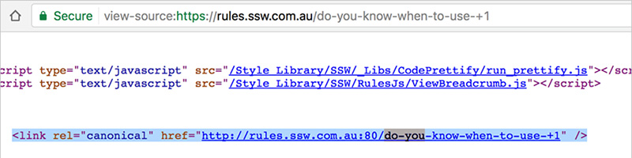

When adding a friendly URL, please avoid using specific characters like “+, :, #, &, (, ), !, \*, [, ], {, }, @, /, =, $” and so on due to multiple reasons:

<!--endintro-->

1. When adding a friendly URL, we meant to make it “ **friendly** " and “ **easy** " for the user to read and remember, so avoid using specific characters and try to make it short.
2. Some characters are unsafe characters, they will be encoded, which end up making the URL really messy and ugly, e.g 
       **double quote** (“) will be encoded to 
       **%22** .

Some characters are reserved characters, which may not be supported by some features, based on our experience, “+" is not supported in “canonical" to redirect from      **http**  to      **https** .

::: ok  
  
:::

In the above source code, the URL     [http://rules.ssw.com.au:80/do-you-know-when-to-use-+1](/do-you-know-when-to-use-+1)*[note: don't include as a hyperlink as it's a broken URL]* will throw a 404 error rather than redirecting to      **https://rules.ssw.com.au:80/do-you-know-when-to-use-+1** ,but it works fine if the URL doesn't include “+", e.g.     [https://rules.ssw.com.au/do-you-know-when-to-use-plus-one](/do-you-know-when-to-use-plus-one).
