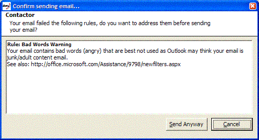

Outlook by default reads your emails and can flag your email as potential junk email, or adult content email by examining a list of Sensitive words. This list is not available to the public. 

 <excerpt class='endintro'></excerpt> 

  
You should avoid any swear words or be using an angry tone as well.

We have a program called <a href="http://www.ssw.com.au/ssw/LookOut/">SSW LookOut! for Outlook</a> to check for this rule.  
  
Figure: SSW LookOut! for Outlook checks that you don't use bad words.​​ 

