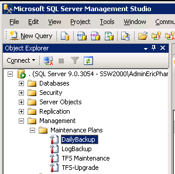

Run your daily backups to provide a safety net should things go wrong.  

<ol><li>Confirm that the TFS2008 databases were backed up last night. 
a. TfsActivityLogging b. TfsBuild c. TfsIntegration d. TfsVersionControl e. TfsWarehouse  f. TfsWorkItemTracking g. TfsWorkItemTrackingAttachments
Figure: If you can’t see the physical .bak file for all these, chase up your DBA</li>
<li>Create a backup of the TFS2008 databases by running your Daily Backup maintenance plan on TFS2008   Figure: Before starting, kick off the daily backups </li></ol>

 <excerpt class='endintro'></excerpt> 

