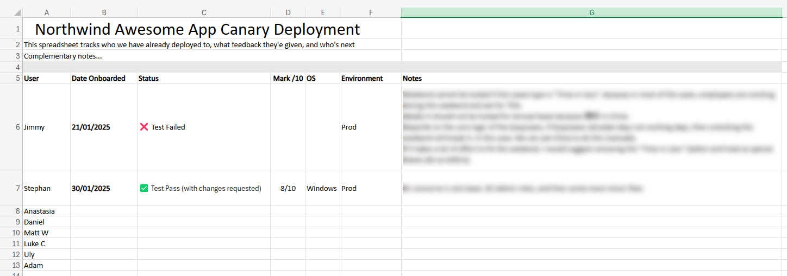

Canary deployments let you release new features or updates to a small group of users first, gather feedback, and reduce the risks of a global rollout. At SSW, we track all our canary testers, their onboarding dates, OS, test status, feedback, and environment in a single spreadsheet.

<!--endintro-->

Using a structured spreadsheet ensures transparency and consistency, so no one is missed and feedback can be actioned quickly.

::: greybox
**Scenario:** You’ve built a new feature and are eager to roll it out to everyone. You ask:

> “Hi team, is anyone free to test the new feature?”

**Outcome:** It’s unclear who will test, when they’ll start, and how feedback is documented.
:::
::: bad
Figure: Bad example – No clear plan, no single source of truth, no tracked outcomes
:::

- - -

::: greybox
**Scenario:** You maintain a single spreadsheet detailing:

1. **User** – Who is invited to test and when  
2. **Date Onboarded** – The date they started testing  
3. **Status** – “Test Passed,” “Test Failed,” or “changes requested”  
4. **Mark /10** – Their rating of the experience (optional but helpful)  
5. **OS** – Their operating system (Windows, Mac, etc.)  
6. **Environment** – e.g. “Prod (Beta)” or “Prod”  
7. **Notes** – Key feedback or suggestions

**Outcome:** Everyone knows who is next to test, what issues have been found, and what the next steps are.
:::
::: good
Figure: Good example – A single, consistently updated spreadsheet for your canary rollouts
:::

::: info
**Note:** Always include any special instructions or edge cases in the **Notes** column so they don’t get missed.
:::

### Steps to implement a canary spreadsheet

1. **Create your spreadsheet**  

   * Include columns for *User*, *Date Onboarded*, *Status*, *Mark /10*, *OS*, *Environment*, and *Notes*.  
   * Store it in a central location (e.g. Microsoft 365, Google Sheets) accessible to all stakeholders, testers and developers.
   * If relevant, feel free to add as many columns as needed.
2. **Identify your canary testers**  

   * Start with a small, diverse set of users.  
   * Include at least one “power user” who knows the system deeply and one “fresh perspective” user.
3. **Onboard each tester**  

   * Give them clear instructions (including any known limitations or the environment’s URLs).  
   * Direct them to fill in or confirm their details in the spreadsheet.
4. **Record feedback**  

   * Ask each tester for a rating (Mark /10) and to log outcomes under Status (Test Passed, Test Failed, etc.).  
   * Document any showstoppers or usability issues in **Notes**.
5. **Iterate quickly**  

   * If someone logs a “Test Failed,” address the issue before inviting more testers.  
   * If changes are requested, update the environment or instructions, then retest.
6. **Go wider**  

   * After successful canary feedback, roll out your feature to all users.  
   * Keep the spreadsheet as a living record of the rollout process.

### Example statuses

* **N/A** – Not started or not applicable yet  
* **✅ Test Pass (with changes requested)** – Feedback is positive, with small tweaks needed  
* **❌ Test Failed** – Showstopper or critical bug prevents completion  

::: tip
Keep your spreadsheet pinned in Teams or Slack channels for easy access.
:::

### Avoid confusion

A canary deployment spreadsheet is your single source of truth. If a tester isn’t responding or is blocked, assign another tester rather than stalling the rollout. Record these changes so it’s clear who tested and when.
