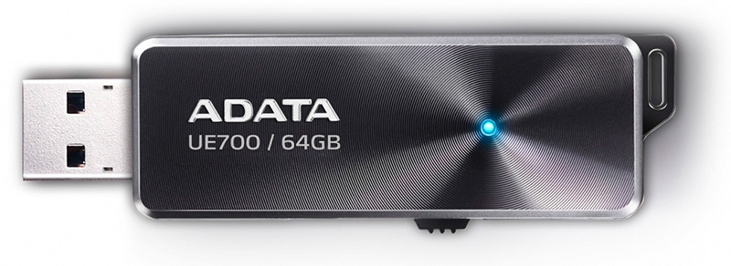

Always carry your USB drive with you - in your pocket, on your key chain or even around your neck. USB drives are particularly useful for storage of large files. A good team member will always have their USB drive available at the drop of a hat.

<!--endintro-->

