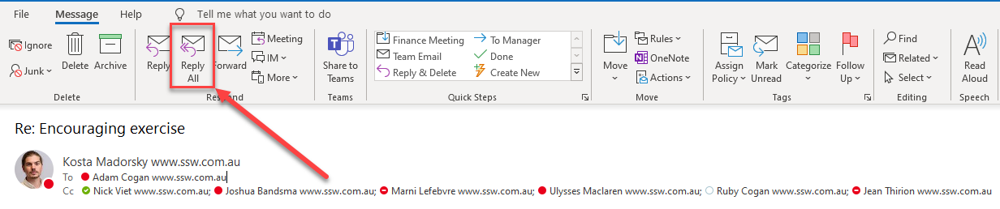
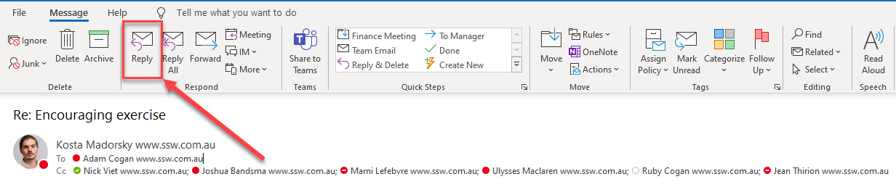
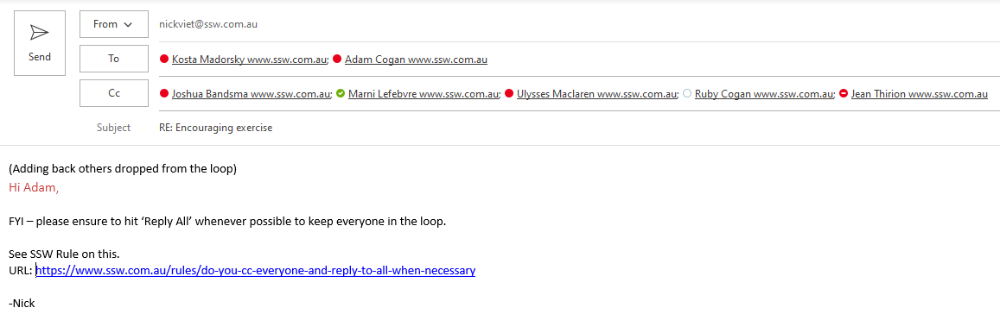

When emailing external parties, it is a good idea to CC the other colleagues within your organization that may have an interest in the email. Some of the benefits of CC'ing others are:

* It can save time
* Gives the email more credibility if you have CC'd others in your organization
* Colleagues may correct your mistakes

<!--endintro-->

In addition, I often see people replying only to the sender of the email, ignoring the fact that there were other persons included in the original email. Obviously the original sender intended to keep everyone in the loop, so it would be polite to CC everyone included on the original communication. The converse is true also - don't cc people unnecessarily - you're just adding to the email problem!

::: good  
  
:::

### What if the other person drops people?

Sometimes the other person will 'little r' reply instead of 'Reply All'. It is not a good habit to little r reply aside for when there are any exceptions noted below. This can be problematic as those dropped off the loop are needed as part of the decision making. Decisions will be harder to be made in a timely manner or end up being made without a full team agreeance over.

At this point if you are still Cc'd, you should reply and add all those dropped from the loop, back into the loop as soon as possible.

::: Bad

:::

::: Good

:::

### Exceptions

* If not all recipients need to be informed
* The opinions of the rest of the recipients do not matter as they are unlikely to disagree
* If the original email was to an alias with many subscribers, in general you should not Reply All.     
* Also, if the sender requests a ['little r'](http://www.ssw.com.au/ssw/Redirect/Netlingo.htm) reply, then you should not 'Reply All'.

**Video:** [Top 10+ Rules to Better Email Communication with Ulysses Maclaren](https://www.youtube.com/watch?v=LAqRokqq4jI)
