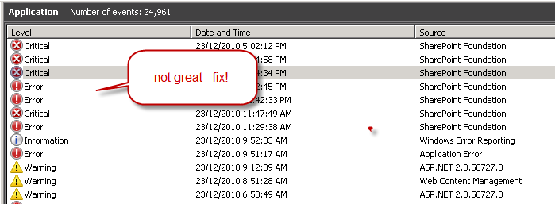

  
After the database has finished being attached to the web application you will get a log file with information about the import process. 

<ol>
    <li>Open up this log fine and pay special attention to any lines with <b>[ERROR]</b>.  
    Note #1: The most common reason for errors is that you have forgotten to activate a feature. 
    Note #2: If you have your own custom solutions, show this file to your developers to ensure it isn’t your custom solution causing the errors.</li>
    <li>Check your Application Event log after migration for errors related to your SharePoint Web Application, and fix these accordingly.</li>
</ol>

  
figure: the event log should show 0 errors after fixing the errors

 <excerpt class='endintro'></excerpt> 

