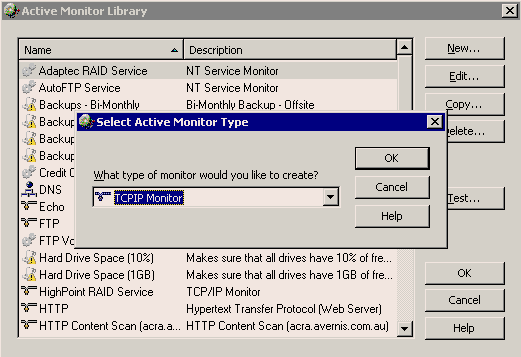

If you want to know your website is working or not, you need to add a ping check to the machine also an HTTP Content Scan to the website in WhatsUp. We use WhatsUp to do real-time monitoring.
​Follow these steps to check your website in WhatsUp:
 <excerpt class='endintro'></excerpt> 
<ol><li>Add your website as a new device. <dl class="image"><dt>  </dt><dd>Figure: New device</dd></dl></li><li>Ping monitor is added automatically. <dl class="image"><dt>  </dt><dd>Figure: Ping monitor</dd></dl></li><li>Add an HTTP Content Scan monitor. <dl class="image"><dt>  </dt><dd>Figure: HTTP Content Scan</dd></dl></li><li>Edit the scan script. In the script, you can see 2 keywords "Send" and "Expect". "Send" expression is an  HTTP request to your website. "Expect" expression is a regular expression to check the key word in response from your website.  <dl class="image"><dt>  </dt><dd>Figure: Edit scan script</dd></dl> </li><li>Add the monitor to your device. <dl class="image"><dt>  </dt><dd>Figure: Add monitor</dd></dl> Once a device is down or up, a WhatsUp action will tell SQL Reporting Services to send out a notification report.  Our report looks like this: <dl class="image"><dt>  </dt><dd>Figure: Website doesn't work </dd></dl><dl class="image"><dt>  </dt><dd>Figure: Website works</dd></dl></li></ol>

