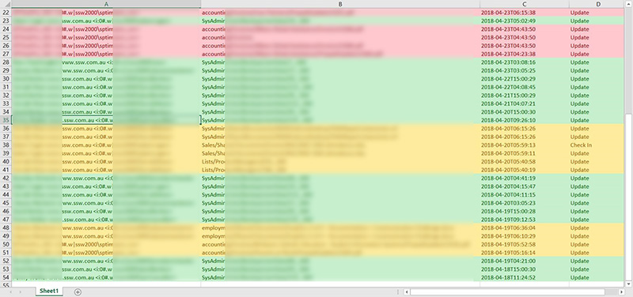

During the migration the site can't be locked if you are [using Sharegate](/_layouts/15/FIXUPREDIRECT.ASPX?WebId=3dfc0e07-e23a-4cbb-aac2-e778b71166a2&TermSetId=07da3ddf-0924-4cd2-a6d4-a4809ae20160&TermId=4ee88718-590a-43fe-bbd8-4557633d1d6f), there is a chance that employees will ignore the instructions in the ribbon and still make changes.

Furthermore, they might also be automated processes that are putting records in your old SharePoint Server.

So to ensure the migration process did not miss any items, ensure nobody modified documents on your old Intranet SharePoint Server. To do that:

<!--endintro-->

1. Navigate to "Site Settings" | "Audit log reports" which will take you there:  
<dl class="image">&lt;dt&gt;  &lt;/dt&gt;<dd>Figure: check nobody was modifying the intranet during the long migration </dd></dl>
2. Click "Content Modifications"
3. Order the generated Excel data by modification date ("Occurred" ) and look for modifications done by users.
4. Chase the people who did the modifications and ask them either to: 
    

    * Redo their modification in your new Cloud intranet (likely)
    * Confirm that the modification is not important and does not require manual migration (less likely)

::: greybox
Hey xxx,

I have noticed that you changed the file “yyy” (link to the file: https://zzz.sharepoint.com/yyy.pdf).
Could you please:
1.	Let me know what were the changes?
2.	Tell me why you did these changes (task, etc…)?

Please note that these changes will be lost as part of the old SharePoint server decommission. If the changes are important, please redo the modifications on the new Online Intranet.
Regards,

-SharePoint Admin Team
:::

    After you export to Excel, follow this example:
<dl class="image">&lt;dt&gt;  &lt;/dt&gt;<dd>Figure: Modifications are done on the old SharePoint intranet during the migration process (hence not migrated to the cloud)</dd></dl>    **Green:** non-important data (automated logging info) - ignore
    **Orange:** potentially important data (user made changes) – ask the user
    **Red:**  critical data (invoices !) – Migrate these documents
