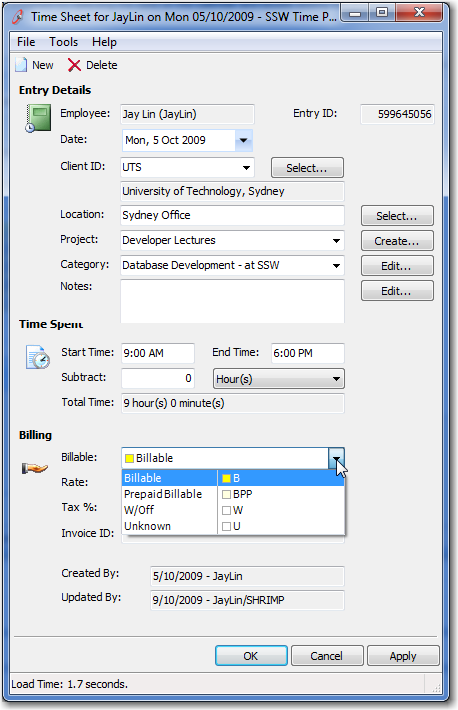

[Controlled Lookup Data](/Pages/DoYouDeployLookupData.aspx) is when data is tightly coupled to the application. If the data is not there, you have problems. So how do we check to see if data is still there?

The simplest way is to add a procValidate (Stored Procedure) to check that all the lookup data is still there.
<dl class="image">    &lt;dt&gt; &lt;/dt&gt;
    <dd>Figure: procValidates are just like a nagging wife </dd></dl>
 Let's look at an example, of a combo that is populated with Controlled Lookup data (just 4 records)    
<!--endintro-->
<dl class="image">    &lt;dt&gt; &lt;/dt&gt;
    <dd>Figure: How do I make sure these 4 records never go missing? </dd></dl><dl class="image">    &lt;dt&gt;
    <pre>CREATE PROCEDURE procValidate_Region 
AS

    IF EXISTS(SELECT TOP 1 * FROM dbo.[Region]
              WHERE RegionDescription = 'Eastern')
        PRINT 'Eastern is there'
    ELSE
        RAISERROR(N'Lack of Eastern', 10, 1)
    IF EXISTS(SELECT TOP 1 * FROM dbo.[Region]
              WHERE RegionDescription = 'Western')
        PRINT Western is there'
    ELSE
        RAISERROR(N'Lack of Western', 10, 1)
    IF EXISTS(SELECT TOP 1 * FROM dbo.[Region]
              WHERE RegionDescription = 'Northern')
        PRINT 'Northern is there'
    ELSE
        RAISERROR(N'Lack of Northern', 10, 1)
    IF EXISTS(SELECT TOP 1 * FROM dbo.[Region]
              WHERE RegionDescription = 'Southern')
        PRINT 'Southern is there'
    ELSE
        RAISERROR(N'Lack of Southern', 10, 1)
</pre>
    &lt;/dt&gt;
    <dd>Figure: Implement a stored procedure to check the 'Controlled Lookup Data' does not go missing </dd></dl> Note: As this procedure will be [executed many times, it must be Idempotent](/Pages/DoYouIgnoreIdempotency.aspx)
