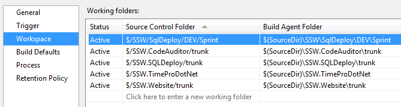
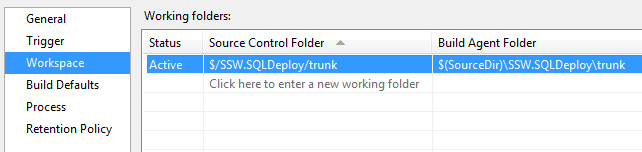

When defining a build, you should always check the Workspace tab. Only the workspace relevant to your build should be included.

<!--endintro-->

If you have a number of Team Projects open from the same TFS Project Collection, all of their workspaces will be included by default.  You should remove those workspaces that aren’t being used otherwise the build server will get the source for every workspace in this list before starting a build.

      **Figure: Bad example – Several workspaces from other team projects are included by default** 

 

 **  Figure: Good example – Only the relevant workspace has been included in this build definition**
