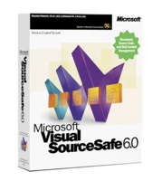
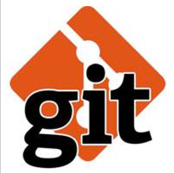
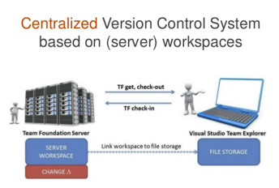
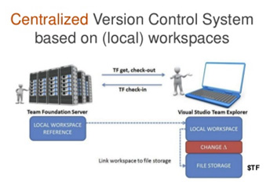
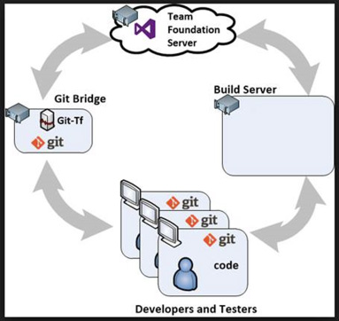

Only a madman would write software today without using source control.

Apart from being the easiest way to back-up your code, and having the ability to go back to a previous state, source control provides a huge number of benefits, especially when integrated with Continuous Integration servers, and Continuous Deployment solutions.

<!--endintro-->

But which source control solution should I choose?
<dl class="badImage">&lt;dt&gt; 
      
   &lt;/dt&gt;<dd>Figure: Bad Example - Unless you have time-travelled back to 1999, you should not be using Visual Source Safe</dd></dl><dl class="badImage">&lt;dt&gt; 
      
   &lt;/dt&gt;<dd>Figure: Bad Example – Git is great, but learning to use ‘pure’ git from the command line can be intimidating for developers not used to working in a console</dd></dl><dl class="badImage">&lt;dt&gt; 
      
   &lt;/dt&gt;<dd>Figure: Bad Example - Team Foundation Source Control – Server Workspaces. This is the source control that we have been using in TFS for years. It’s great, even on large code bases, except for when you are not connected to the TFS server. (Image from 
      <a href="http://bit.ly/why-tfs-git">http://bit.ly/why-tfs-git</a>)</dd></dl><dl class="badImage">&lt;dt&gt; 
      
   &lt;/dt&gt;<dd>Figure: Bad Example – Team Foundation Source Control – Local Workspaces. It’s great for when you are not connected to the TFS Server, except for when your code-base is very large. (Image from 
      <a href="http://bit.ly/why-tfs-git" target="_blank">http://bit.ly/why-tfs-git</a>)</dd></dl><dl class="goodImage">&lt;dt&gt; 
      
   &lt;/dt&gt;<dd>Good Example – TFS Git works fantastically offline and with large code-bases. Visual Studio has support for the basic operations so developers can ease their way into working with git. Once users become familiar with it, it also allows for far more control and flexibility. Note: My Work and Code Review are not currently compatible with TFS Git, and you will need to fall back to the Git command line for more complex source control commands</dd></dl>**Resources:** [Taking your version control to a next level with TFS and Git](http://bit.ly/why-tfs-git)by Alexander Vanwynsberghe.
