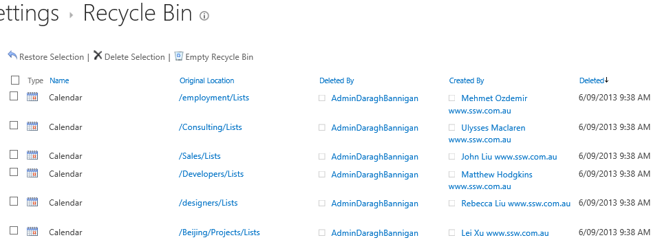

Most SharePoint site templates contain a calendar list, this will bring lots of useless calendars.

 <excerpt class='endintro'></excerpt> 

​Use the below PowerShell script to clean them:​​

$site = Get-SPSite("http://<site collection URL>/"); # Specify url here​ ​foreach ($web in $site.AllWebs) {    ​     $lists = $web.Lists     for ($i=($lists.Count-1);$i -gt 0; $i--) {           $list = $lists[$i]         #Write-host $i  $list.Title $list.BaseTemplate.ToString()         if ($list.BaseTemplate.ToString().ToLower().contains('events')) {                   if ($list.Items.Count -eq 0)             {​                 Write-Host $list.Items.Count "items in the list" $list.Title '('$list.BaseTemplate') at '$web.Url "- cleaning it!"                 $list.Recycle()                 #$list.Delete()             }         }     } }  ​ 

This script will put the calendars which do not have any events into <strong>Site Settings</strong> | <strong>Recycle Bin</strong>: 
<dl class="ssw15-rteElement-ImageArea">​</dl><dd class="ssw15-rteElement-FigureNormal">​Figure: Empty Calendars in Recycle Bin folder</dd>
​ 

