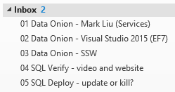

​​​​​​​​​With a mountain of emails, it is difficult to make sure the most important tasks get done first. You want to keep your clients happy while still removing roadblocks for others.  
 <excerpt class='endintro'></excerpt> 
<dl class="image">
 ​The word "Urgent" is more important than the word "Important" 
<dt>  </dt><dd>Figure: Remove roadblocks</dd></dl>
This is the order which you should work:
<ol><li> 
      <strong>Urgent emails</strong> - emails with "URGENT" in the subject e.g. URGENT - the website is down</li><li>Emails about <strong></strong> <a href=/do-you-know-how-important-timesheets-are>Timesheets </a>or invoicing issues </li><li>Your calendar - <a href=/calendar-does-your-calendar-always-accurately-show-where-you-are>keep your calendar up-to-date,​ ​​</a>so people know where you are  </li><li> 
      <strong>Your existing clients</strong> - e.g. Normal planned client work and client administration (preferably working on a sprint <a href=/do-you-know-how-to-manage-the-product-backlog>backlog</a> and Daily Scrums) </li><li> 
      <strong>Other client work</strong> - Ask others if you can help with their client work</li><li> 
      <strong>Prospective clients</strong> - project management, answering questions and setting up meetings</li><li>Internal - all of the following might have their priorities ordered by the Daily Scrum</li><ol><li>Quick Important emails to 0 (emails with an important flag &lt; 1 hour and not something that can go into a release plan)</li><li>Incomplete <a href="http://sharepoint.ssw.com.au/Standards/Management/RulesToBetterScrumUsingTFS/Pages/SprintPlanning%28WHAT%29Meeting.aspx">Sprints</a> (was "<a href="http://sharepoint.ssw.com.au/Standards/Management/RulesToBetterProjectManagement/Pages/DetailedReleasePlan.aspx">release plans</a>") e.g. Normal planned internal work</li><li>Important emails to 0</li><li>Help others get their important emails to 0</li><li>Get your inbox to 0</li><li>Ping others to see if they need help completing their <a href="http://sharepoint.ssw.com.au/Standards/Management/RulesToBetterScrumUsingTFS/Pages/SprintPlanning%28WHAT%29Meeting.aspx">Sprint</a></li></ol><li>Phew... Done...  </li></ol><dt>
Tip #1: Don't move an important task out of your inbox unless: 
<ul><li>Someone else is going to do it right away; or </li><li>It is going into a Sprint </li></ul>

</dt> 

Tip #2: Use inbox subfolders to group and prioritize tasks   
<dl class="goodImage"><dt>  </dt><dd>Figure: Group by subfolders under your inbox</dd></dl><dl class="goodImage"><dt>  </dt><dd>Figure: Efficient people keep a priority list (often written)</dd></dl>
Also, it's common that priority orders change, but clients don't always mean to, so double check that the client means this.
<dl class="good">
When someone is asking you to do a new task, and you are still working on some other task, you should ask:  "Are you changing the priority order? Do you want this new task done before the current task I'm working on, which is xxx."
<dd>Figure: Confirm with the client "Are you changing the prior order?"</dd></dl><dl class="goodImage"><dt>  </dt><dd>Figure: Prioritization - The most recent task assigned is not necessarily the most important. Mentally do this (e.g. an air traffic controller does not deal with the newest plane that has popped up on his radar when he has 4 lined up to land  </dd></dl>

