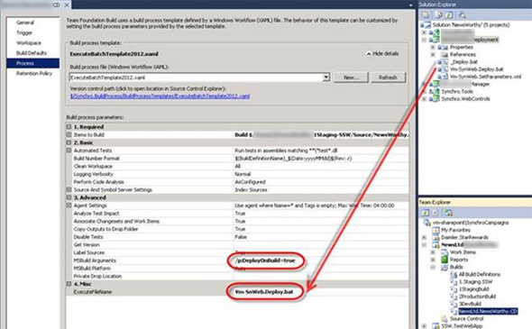

Configure the ExecuteBatchTemplate Build Process Template.

<!--endintro-->
<dl class="image">&lt;dt&gt;
&lt;/dt&gt;<dd>Figure: Enter the DeployOnBuild MsBuild argument, and then enter the name of the deployment batch file you wish to execute upon successful build of the project.
 Every time this build is executed successful (and all the unit tests pass), the specified batch file will run – deploying the site automatically.
</dd></dl>
