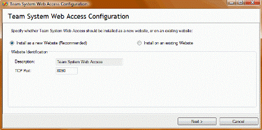

If you have [Team System Web Access](http://www.ssw.com.au/SSW/Redirect/Microsoft/TSWA.htm) installed and you need to access it from wherever you are, you can configure a port to be forwarded to the server where Team System Web Access is installed, eg: tfs.your-domain.com:8090.

<!--endintro-->
<dl>&lt;dt&gt;&lt;/dt&gt;
<dd>Figure: Visual Studio Team System Web Access Power Tool </dd></dl>
