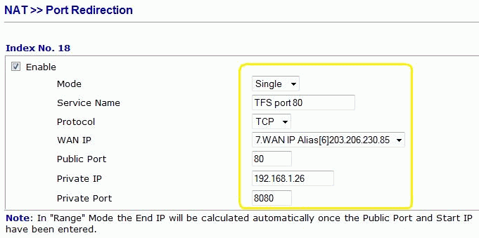

<ul><li>TFS SP1  This feature called "Extranet Support" was added way back in TFS 2005 SP1 as per <a href="http://www.ssw.com.au/ssw/Redirect/StandardsRules/MSDNBlog.htm">Stuff in the pipe for Team Foundation Server</a> ​</li><li>A domain name or IP address forwarded to TFS (eg: tfs.your-domain.com)</li><li>Port 8080 (this is port that TFS uses for source control)</li><li>Firewall/Router rule (ideally)​</li></ul>
 <excerpt class='endintro'></excerpt> 

Tip: You can solve this with TFS Extranet Support:
 

Yes Port 8080 will work in most cases but not on the strictest networks, where only Port 80 is allowed. 
    Then you have to use port forwarding via a firewall/router rule (recommended) to forward port 80 to the TFS port, while in this way, you would lose the TFS SharePoint Portal and Reporting Services. 
<dl><dt>
      
   </dt><dd>Figure: Rule to forward port 80 to the TFS port </dd></dl>

