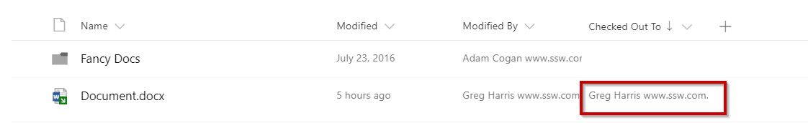
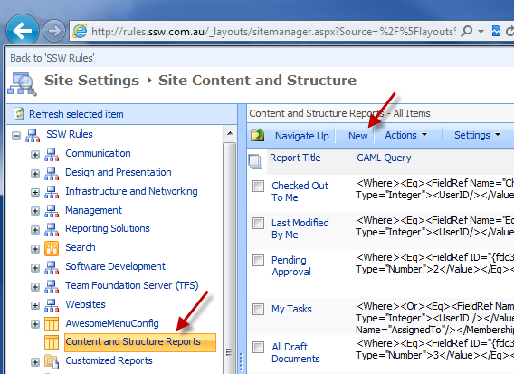
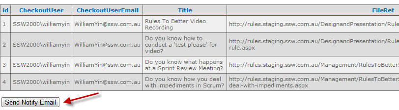

​ 

One of the annoying things with SharePoint document libraries is that users often accidentally leave checked out files, that preventing others from modifying them.​​ 

Suggestion to Microsoft: send an email to the user to remind them they have outstanding checkouts potentially blocking other users.
<dl class="image"><dt> 
       
   </dt><dd>Figure: Here Greg Harris has not checked in a file </dd></dl>

 
   <b>Upgrade warning:</b> The pages that are not checked-in, will not be migrated on a SharePoint upgrade. There is *no* warning either.​

There are 2 ways to remind users of their "checked out files":​ 
<ul><li>
      <strong>Solution A: Manage Content and Structure Report (No Code)​</strong></li><li>
      <strong><strong>Solution B: Custom application report (Includes some coding work)​ Eg. SSW.Dory​​ </strong></strong></li></ul>
 <excerpt class='endintro'></excerpt> 
​ 

   <strong>Solution A. Manage Content and Structure Report (No Code)</strong>

1. Create CAML query in site content and structure

Go to "Site Settings | Manage Content and Structure | Content and Structure Reports", click "New":
<dl class="image"><dt> 
       
   </dt><dd class="ssw-rteStyle-FigureNormal">Figure: Create a new report</dd></dl>

   Fill the "CAML Query": 
   
<Where><IsNotNull><FieldRef Name="CheckoutUser" LookupId="TRUE"/></IsNotNull></Where>

Fill the other fields like below:
<dl class="image"><dt> 
          
      </dt><dd>Figure: Fill in form</dd></dl>
2. Run Checked Out report

 

Run the checkout report from "Site Settings | Manage Content and Structure | View: Checked out documents":
<dl class="image"><dt> 
          
      </dt><dd>Figure: Checked Out Documents report link Make sure there are no files checked out, otherwise, go step 3</dd></dl>
3. Go chase after the users.
​ 
   

      <strong>Solution B. Custom application report (Includes some coding work) </strong> 

       
         <b>TODO: </b>Move this tool to GitHub, find a better name than "SSW.SharePoint.CheckedOutFilesReport".  
       Also change from a farm solution to a solution that can be used on Office365 - now in SharePoint 2016 and SharePoint online called "Sharepoint Add-ins" 

       
          To make reminding users easier, this SharePoint Add-in ha​s a custom page to show the "Checked out files". One button will send the notification email to all the naughty people.   

Even better, we have also improved the application with a scheduled task using SharePoint CSOM API to find checked out files and send these notification emails automatically​ every night. ​ 
<dl><dt>
         
      </dt><dd>Figure: One button reminds all users of their "Checked out Files"  </dd></dl>

         <strong>Hi Sophie, </strong>

         <strong></strong> 

You have some pages checked out in SharePoint.
<blockquote dir="ltr" style="margin-right:0px;">
1. You should check in at least daily. Revise our SSW rule <a href="/Pages/DoYouConfirmThereIsNoCheckedOutData.aspx">on Frequent SharePoint Check-ins</a>. 2. If you are no longer editing these files, check them in! 

3. Reply to this email with something like:     ‘Done - x files checked in’

 

You currently have the following pages checked out: 
</blockquote><blockquote dir="ltr">
• 
            <a href="/Pages/DoYouConfirmThereIsNoCheckedOutData.aspx">http://<siteurl>/DesignandPresentation/RulesToBetterVideoRecording/Pages/Default.aspx</a>  (parent folder) • 
            <a href="/Pages/DoYouConfirmThereIsNoCheckedOutData.aspx">http://<siteurl>/DesignandPresentation/RulesToBetterVideoRecording/Pages/testing-rule.aspx</a>  (parent folder)
</blockquote>

          Tip: See all files you have checked out at <a href="/Pages/DoYouConfirmThereIsNoCheckedOutData.aspx">http://<siteurl>/_layouts/SSWReports/CheckedOutReport.aspx</a>

<As per rule http://rules.ssw.com.au/ITAndNetworking/SharePoint/Pages/DoYouConfirmThereIsNoCheckedOutData.aspx> 

 -- Powered by SSW.Dory -- v16.1.7122.24300 Server: DESKTOP-C7SF4A3

  

<dd class="ssw15-rteElement-FigureNormal"> Figure: An example of the reminder email that all users receive </dd><dd class="ssw15-rteElement-FigureNormal">
        </dd>

