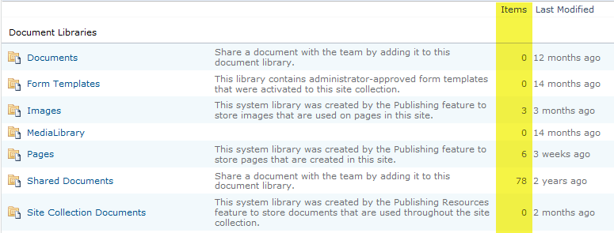

  
After you have finished migrating the database, it is extremely important to verify that no data has been lost in the move. The quickest way to do this is to compare the SharePoint 2007 and the SharePoint 2010 server <b>All Site Content</b> pages and confirm that the item numbers match:

 

<b>Figure 7 – In the "All Site Content" pages library, ensure the ‘item’ numbers exactly match between SharePoint 2007 and SharePoint 2010</b>

<ol>
    <li>Look at your report from the SharePoint 2007 server </li>
    <li>On the SharePoint 2010 server, open the site collection you just migrated to</li>
    <li>Select <b>Site Actions | Site Settings</b></li>
    <li>Select <b>All Site Content</b></li>
    <li>Compare item numbers with 2007</li>
</ol>

Repeat this process for all sub-sites of the site collection you migrated.

 <excerpt class='endintro'></excerpt> 

