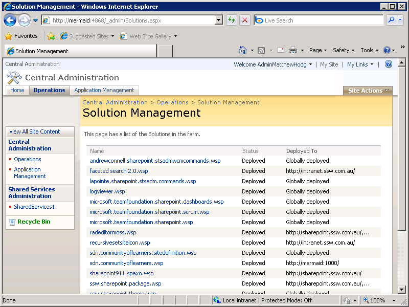

When you move to SharePoint 2010, nothing is to unexpectedly disappear. So prior to the migration, you need to find out which solutions you currently have installed and decide if you will be installing them on the new server.   
<!--endintro-->

1. On the SharePoint 2007 Server, open         **Central Administration** and go to         **Operations | Solution Management**
2. Copy the         **Solution Name, Status** and         **Deployed To** into the following table. This will ensure you deploy all the solutions you had on your old server to the SharePoint 2010 server
3. Cross out any solutions that you will not be migrating
4. Get the SharePoint master to sign off on the solution list

Figure: Have your SharePoint Master confirm if all these solutions are to be migrated

   <h3>Download</h3>    
   <a href="http://intranet.ssw.com.au/SysAdmin/SharedDocuments/MSSharePoint/HowTos-DoYouConfirmYourListOfInstalledSharePoint2007Solutions.docx" shape="rect">Download the “Installed Solutions Checklist”</a> 
