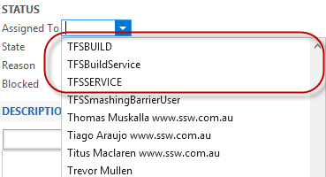
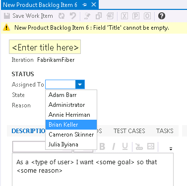

​The default WIT doesn’t control the valid drop down
items in Assigned To filed, this will introduce unnecessary items to be shown
in the list which will make your users confused, e.g. TFSBUILD, tfsBuildService
should never be used to assign a job.  Figure: Bad Example – shown unnecessary values
 <excerpt class='endintro'></excerpt> 
You can add the following XML in the Assigned To filed definition to control the valid values​:​​​​​​​​​​ 

<FIE​LD name="Assigned To" refname="System.AssignedTo" type="String" reportable="dimension" syncnamechanges="true">   ​<ALLOWEXISTINGVALUE />   ​<REQUIRED />   <ALLOWEXISTINGVALUE />   <VALIDUSER />   <ALLOWEDVALUES expanditems="true" filteritems="excludegroups">         <LISTITEM value="Active" />         <LISTITEM value="[project]\xxxxDepNamexxxxGroup" />   </ALLOWEDVALUES> </FIELD>​ ​   

Figure: Use ALLOWEDVALUES to control the values in Assigned to field   Figure: Good Example – shown necessary values

​

