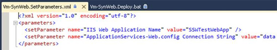
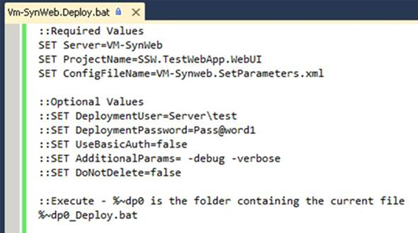

You should create a Deployment Batch file and SetParameters file for each Environment.

 <excerpt class='endintro'></excerpt> 
<dl class="goodImage"><dt> 
       
   </dt><dd>Figure: Good Example - The batch file specifies the target Server, the ProjectName name to deploy, and the configuration file to use. You can also optionally supply additional parameters. 
      <a href="/Documents/DeployBat.txt">Download a sample _Deploy.bat file here as a .txt file</a>. </dd></dl><dl class="goodImage"><dt> 
      
   </dt><dd>Figure: Good Example - The SetParameters file specifies MS Deploy parameterisation values.  Most important is the target “IIS Web Application Name” on the target server See 
      <a target="_blank" href="http://vishaljoshi.blogspot.com.au/2010/07/web-deploy-parameterization-in-action.html">Vishal’s blog</a> for more details. </dd></dl>

