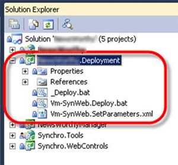
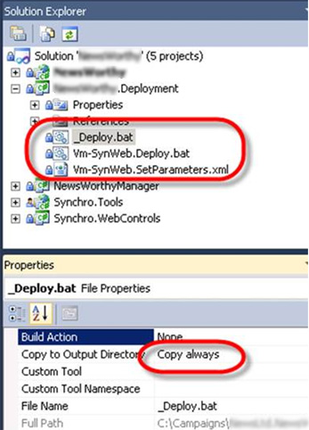

Your source control repository should be the source of all truth. Everything, always, no-matter what should go into source control.

This includes any deployment scripts and Web Deploy parameter files if you need them.

<!--endintro-->

This includes your deployment scripts and Web Deploy parameter files.
<dl class="goodImage">&lt;dt&gt; 
       
   &lt;/dt&gt;<dd>Figure: Good Example - Create a Deployment project alongside your web project.  </dd></dl> In the image aboce, Vm-SynWeb.Deploy.Bat is a batch  file that will deploy your web site to Vm-SynWeb
 Vm-SynWeb.SetParameters.xml is a Web Deploy SetParameters file that specifies environment specific settings.
 \_Deploy.Bat is the base batch file that your environment specific deployment batch files will call. <dl class="image">&lt;dt&gt; 
       
   &lt;/dt&gt;<dd>Figure: It is important that each of the batch and parameters files has it ‘Copy to Output Directory’ setting set to ‘Copy Always’</dd></dl>
