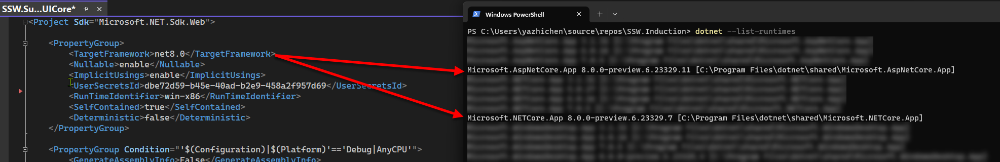
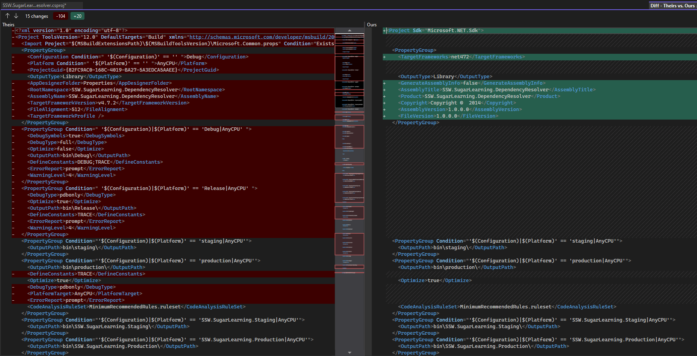
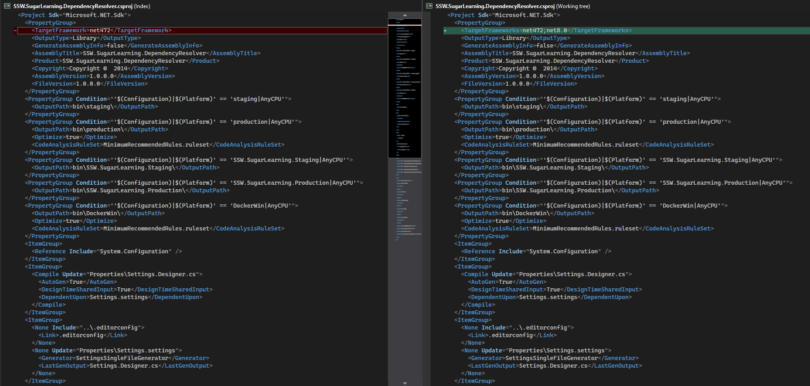

Migrating from .NET Framework (4.x) to the latest .NET (5+) brings huge advantages to your app's performance, hosting fees, and maintainability. But it's important that you understand what the road to .NET 5+ looks like for your app *before* you start breaking things! So how do you ensure your migration is being done the right way?

<!--endintro-->

## Preparation

The migration to a newer version of .NET is the perfect opportunity for you to take stock of your current application architecture, and address any technical debt your app has accumulated. Trying to migrate an application that's poorly architected or carrying a lot of tech debt will make your migration **exponentially harder**. Therefore, now is the time to perform a full audit of your app and ensure you have PBIs to rectify these problems before you consider it "migration-ready".

### Manual dependency analysis

Imagine a typical N-tiered application. Over the course of its life, the lines between each tier will often get blurred, either accidentally or deliberately. This can result in certain dependencies appearing where they shouldn't - such as `System.Web` references showing up in your application or data layer. This is a very common code smell and a great starting point to cleaning up your app.

If your app has 3rd party dependencies (e.g. with a financial system, reporting system, etc.) - now is the time to investigate those integration points to determine whether those services provide compatible libraries and how those libraries differ (if at all). Create PBIs for these as well.

### Infrastructure

If you host your app on premise, it's also worth checking your infrastructure to ensure it has the necessary runtimes.



## Breaking changes

Once you've addressed any technical debt or architectural concerns, you can start gauging the amount of work involved in the migration itself.

::: greybox
**Tip:** You want to work from the bottom up in N-tiered applications (or inside-out with Onion architecture). This will allow you to work through the migration incrementally, and address any breaking changes *upstream*. If you migrate top-down (or outside-in), you will find yourself having to rewrite *downstream* code multiple times.
:::

### Upgrade the csproj files

The first thing you want to do is update your projects' `csproj` files to the new SDK-style format. This greatly simplifies the contents of the file, and will allow you to easily target multiple versions of .NET framework monikors simultaneously (more on this below).

::: greybox
**Tip:** You can use the [try-convert](https://github.com/dotnet/try-convert) dotnet tool to convert your projects to the new sdk style csproj format.

Install the tool using:

```bash
dotnet tool install -g try-convert
```

...and your other projects using:

```bash
try-convert --keep-current-tfms
```

**Note:** For Web applications, we'll update at a later stage based on [migrating Web Apps to .NET](/migrating-web-apps-to-dotnet/).
:::



### Target multiple Target Framework Monikers (TFM)

Now you have shiny new SDK-style `csproj` files, it's time to see what breaks!

Targeting both your current .NET Framework version *and* your future .NET version will give you the following information:

* Expose any build errors you receive when trying to build for .NET
* Expose any build errors you receive when trying to build for .NET Framework

::: greybox
Why is this important?

Imagine you *don't* do this, and instead, you simply target the newer version of .NET. You get a list of 100 build errors due to breaking changes - too many for 1 Sprint (or 2 Sprints, or 3).

You start fixing these build errors. You go from 100 errors to 50 - progress!
Then you're told there's an urgent bug/feature/whatever that needs fixing ASAP. But you've still got 50 build errors when you're targeting .NET.

"No problem", you say. "I'll just switch back to .NET Framework and do this fix, and push out a new deployment".

You switch to .NET Framework, build the project, and...25 build errors?!

While you were fixing those build errors, you wrote code that isn't compatible with .NET Framework. Now you have an urgent bug/feature/whatever, as well as 25 new build errors you have to solve ☠️.

Using multiple TFMs from day 1 ensures you are fixing the breaking changes for .NET, *without* introducing breaking changes in .NET Framework.

This allows you up to work on your migration PBIs **incrementally**, while still allowing you to deploy your app on the current .NET version - win/win!
:::

In all your project files, change the `TargetFramework` tag to `TargetFrameworks`. You want to do this early on to enable a smoother flow later to not need unload and reload projects or have to close and reopen Visual Studio.

```csharp
<TargetFrameworks>net472;net8.0</TargetFrameworks>
```



### Creating the migration backlog

At this point, ensure your project can target both the .NET Framework and the new target .NET. Some of the projects might not support both platforms right away and you can follow these steps to fix the issues and have a better understanding of how much work it might lies ahead.

1. Add the target framework to your project
2. Compile to see what breaks
3. Fix what is easy to fix
   1. Remember to commit after each fix to help your reviewers 😉
4. Anything that is not easy to fix, create a PBI with details of the issue
   1. This allows another developer on your team to work on that PBI independently
5. If you have a project that is able to compile at this point you can leave the new TFM in your project and continue to the next project
   1. If not, you can remove the new TFM and continue to the next project
   2. Repeat these steps once the PBIs have been completed related to this project

By the end of this process, you'll have a much clearer view (and backlog!) of your path to the latest .NET:

* PBIs for technical debt
* PBIs for architectural concerns
* PBIs for breaking changes

## What's next?

While this guide aims to give you a high-level view of migrating your app, there are other some special considerations when dealing with complex applications and web apps. Check out these other rules:

* [Migrating web apps to .NET Core](/migrating-web-apps-to-dotnet/)
* [Do you know how to migrate from System.Web to modern alternatives?](/migrate-from-system-web-to-modern-alternatives/)
* [Do you know how to migrate from EDMX to EF Core?](/migrate-from-edmx-to-ef-core/)
