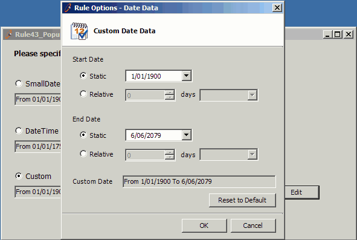

If you want to edit a single item in your form we suggest you use a  popup form. This gives each form a definite function and neat UI design.

<!--endintro-->
<dl class="badImage">&lt;dt&gt;
      
   &lt;/dt&gt;<dd>Figure: Bad Example - Edit controls and main UI are messed up.</dd></dl><dl class="goodImage">&lt;dt&gt;
      
   &lt;/dt&gt;<dd>Figure: Good Example - Use a popup form to do edit.</dd></dl>
